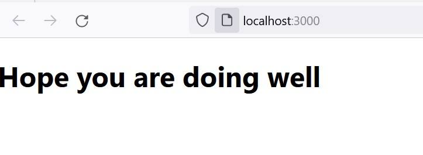

# 📗 Table of Contents



- [📖 About the Project](#about-project)
  - [🛠 Built With](#built-with)
    - [Tech Stack](#tech-stack)
    - [Key Features](#key-features)
 - [🚀 Live Demo](#live-demo)
- [💻 Getting Started](#getting-started)
  - [Setup](#setup)
  - [Prerequisites](#prerequisites)
  - [Install](#install)
  - [Usage](#usage)
  - [Run tests](#run-tests)
  - [Deployment](#deployment)
- [👥 Authors](#authors)
- [🔭 Future Features](#future-features)
- [🤝 Contributing](#contributing)
- [⭐️ Show your support](#support)
- [🙏 Acknowledgements](#acknowledgements)
- [📝 License](#license)

# 📖 hello-react-front-end <a name="about-project"></a>

**hello-react-frontend** is a frontend application to show the greetings message in html converting the json response fetched from the rails api
<a href="https://github.com/chiztechnology/hello-rails-backend">hello-rails-back-end </a>" 

## 🛠 Built With <a name="built-with"></a>
 >React
 >Redux-toolkit
### Tech Stack <a name="tech-stack"></a>

<details>
<summary>React</summary>
  <ul>
    <li><a href="https://react.dev/">React</a></li>
  </ul>
</details> 
</details> 
<summary>React</summary>
  <ul>
    <li><a href="https://redux-toolkit.js.org/">Redux Toolkit</a></li>
  </ul>
</details> 

### Key Features <a name="key-features"></a>

- **Setup the react**
- **Setup redux toolkit to store the application state**
<p align="right">(<a href="#readme-top">back to top</a>)</p>

##🚀 Live Demo <a name="live-demo"></a>

- [Not depoyed yet]

<p align="right">(<a href="#readme-top">back to top</a>)</p>


## 💻 Getting Started <a name="getting-started"></a>

> This is an app where one can have the basic knowledge on how to create api using rails and create a react frontend app using that api

To get a local copy up and running, follow these steps.

### Prerequisites

In order to run this project you need:
- react
- redux toolkit
  <br>


### Setup

Clone this repository to your desired folder:

  git clone https://github.com/chiztechnology/hello-react-frontend.git
### Install

Install this project with:
npm install

### Usage

To run the project, execute the following command:
```sh
  cd hello-react-frontend
  npm start
```
### Run tests

To run tests, run the following command:

rspec

Integration Test:
 rspec ./spec/feature
 
--->
### Deployment
 deploy this project using:

<!-

```sh
  npm build
```
  
 -->

<p align="right">(<a href="#readme-top">back to top</a>)</p>


## 👥 Authors <a name="authors"></a>

👤 **Israel CHIZUNGU**

- GitHub: [chiztechnology](https://github.com/chiztechnology)
- Twitter: [IsraelChizungu](https://twitter.com/IsraelChizungu)
- LinkedIn: [IsraelChizungu](https://www.linkedin.com/in/israelchizungu/)


<p align="right">(<a href="#readme-top">back to top</a>)</p>


## 🔭 Future Features <a name="future-features"></a>

- Adding Styling

<p align="right">(<a href="#readme-top">back to top</a>)</p>


## 🤝 Contributing <a name="contributing"></a>

Contributions, issues, and feature requests are welcome!

Feel free to check the [issues page](../../issues/).

<p align="right">(<a href="#readme-top">back to top</a>)</p>

## ⭐️ Show your support <a name="support"></a>

> If you like the project Please do not hesitate if you have any questions

<p align="right">(<a href="#readme-top">back to top</a>)</p>

## 🙏 Acknowledgments <a name="acknowledgements"></a>


## 📝 License <a name="license"></a>

This project is [MIT](./LICENSE) licensed.

<p align="right">(<a href="#readme-top">back to top</a>)</p>
